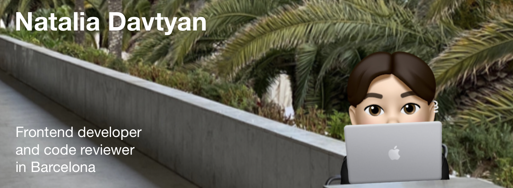

# Hi, I'm Natalia (she / her) 👋🏻👩🏻‍💻✨
 

# About Me:
🔭 I’m currently reviewing students' solo project codes at Scrimba 👯 I’m looking to collaborate on a group project 🤠I’m looking for help with finding my first job in Barcelona, Spain 🌱 I’m currently learning React Router 6 💬 Ask me about why I think coding is a creative process ⚡ Fun fact: I am a photographer and used to be a publisher of a lifestyle magazine about runners

# Tech Stack:
         
